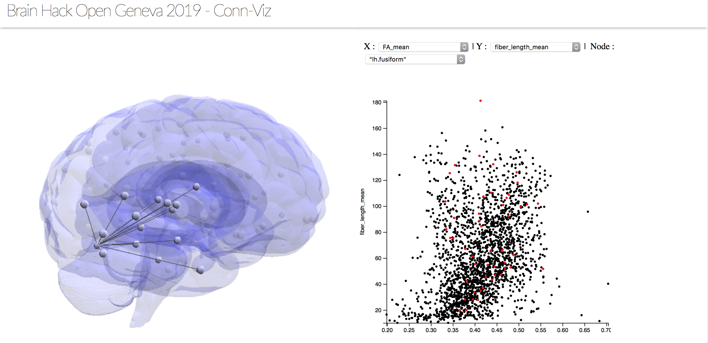

# conn-viz
OG 2019 - Project 08: Visualizing brain connectomics using D3.js

[Video](https://youtu.be/tXc7ly_bk-0)

Open-source visualization tool for connectomics that uses D3.js to display connectivity data summary using 3D brain model rendering, chord diagram, histograms and scatterplot.
Uses JSON format (networkx) to specify edges ID, labels, and properties (metrics).
Uses CSV format to store coordinates of nodes.
Uses Three.js for 3D brain rendering.

## Contributors:

- Augustin Joëssel
- Tan Pei Lei
- Renaud Marquis
- Nils Schaetti

## TODO:

- add chord diagram including interactive highlight with mouse hover linked with 3D brain render and scatterplot
- load your own data / atlas menu
- optionally replace existing vs add new connectivity data/atlas: multiscale parcellations, multimodal brain connectivity, e.g. EEG / fMRI / DWI
- fix histograms with optimized binning (Freedman–Diaconis rule) to visualize distribution of selected metrics, optionally with slider for binning adjustment
- global menu for threshold value linked with 3D brain render and chords
- add volumetric rendering of atlas regions
- color coding of nodes based on node-specific metrics, e.g. volumetric measures

